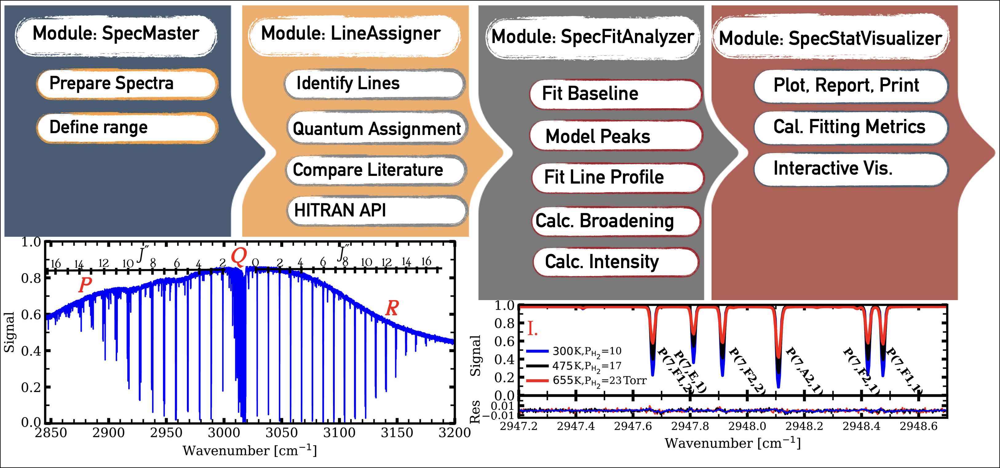

# Xpectra
for analyzing exoplanetary spectra in the lab, providing insights into atmospheric composition and habitability

# Xpectra

[//]: # ([![PyPI - Latest Release]&#40;https://img.shields.io/pypi/v/TelescopeML.svg?logo=pypi&logoColor=white&label=PyPI&#41;]&#40;https://pypi.python.org/pypi/TelescopeML&#41;)

[//]: # ([![DOI]&#40;https://zenodo.org/badge/DOI/10.5281/zenodo.10183099.svg&#41;]&#40;https://doi.org/10.5281/zenodo.10183099&#41;)

[//]: # ()
[//]: # ([![Build Status]&#40;https://app.travis-ci.com/EhsanGharibNezhad/TelescopeML.svg?branch=main&#41;]&#40;https://app.travis-ci.com/EhsanGharibNezhad/TelescopeML&#41;)

[//]: # ([![.github/workflows/draft-pdf.yml]&#40;https://github.com/EhsanGharibNezhad/TelescopeML/actions/workflows/draft-pdf.yml/badge.svg&#41;]&#40;https://github.com/EhsanGharibNezhad/TelescopeML/actions/workflows/draft-pdf.yml&#41;)

[//]: # ([![pages-build-deployment]&#40;https://github.com/EhsanGharibNezhad/TelescopeML/actions/workflows/pages/pages-build-deployment/badge.svg&#41;]&#40;https://github.com/EhsanGharibNezhad/TelescopeML/actions/workflows/pages/pages-build-deployment&#41;)

[//]: # ([![License: GPL v3]&#40;https://img.shields.io/badge/License-GPLv3-blue.svg&#41;]&#40;https://www.gnu.org/licenses/gpl-3.0&#41;)

[//]: # (![Python]&#40;https://img.shields.io/badge/python-3.9-blue.svg&#41;)

[//]: # ([![Downloads]&#40;https://static.pepy.tech/badge/telescopeml&#41;]&#40;https://pepy.tech/project/telescopeml&#41;)

``Xpectra`` is a Python package comprising a series of modules, each equipped with curve fitting and statistical capabilities for conducting spectral analysis tasks on molecular and atomic spectra recorded from laboratory spectroscopic measurements to understand the atmospheres of extrasolar planets and brown dwarfs.
The tasks executed by the ``Xpectra`` modules are outlined below:

- *SpecFitAnalyzer module*: Implements curve fitting to subtract baseline and predict spectroscopic parameters:

  - Preprocess laboratory spectrum
  - Correct spectral baseline 
  - Fit spectral peaks
  - Extract spectroscopic parameters 

- *SpecStatVisualizer module*: Utilizes interactive plotting with Bokeh to explore the data:

  - Visualizing the data in specified range
  - Explore spectral features 
  - Represent results 

- *LineAssigner module*: Parses HITRAN line lists to load and identify spectral lines:

  - Load and parse HITRAN line list
  - Tabulate spectroscopic parameters 
  - Identify spectral lines 

- *FitLiteratureData module*: Implements parallel processing to update HITRAN line list using literature:

  - Collect and vet literature coefficients 
  - Fit pressure-broadening accross quantum numbers, symmetry, and bands
  - Modify and update HITRAN line list 

or simply...

 - Load laboratory spectra
 - Follow the tutorials
 - Label the quantum assignments by connecting to the HITRAN database
 - Extract spectroscopic parameters, e.g., line position, pressure-broadening coefficients
 - Report the statistical analysis

## Documentation

- Documentation: https://ehsangharibnezhad.github.io/Xpectra/
- Installation: https://ehsangharibnezhad.github.io/Xpectra/installation.html
- Tutorials: https://ehsangharibnezhad.github.io/Xpectra/tutorials.html
- The code: https://ehsangharibnezhad.github.io/Xpectra/code.html

## Contributors

<!-- ALL-CONTRIBUTORS-BADGE:START - Do not remove or modify this section -->

<!-- ALL-CONTRIBUTORS-BADGE:END -->

Thanks goes to these wonderful people ([emoji key](https://allcontributors.org/docs/en/emoji-key)):
<!-- ALL-CONTRIBUTORS-LIST:START - Do not remove or modify this section -->
<!-- prettier-ignore-start -->
<!-- markdownlint-disable -->

<!-- ALL-CONTRIBUTORS-LIST:END -->
